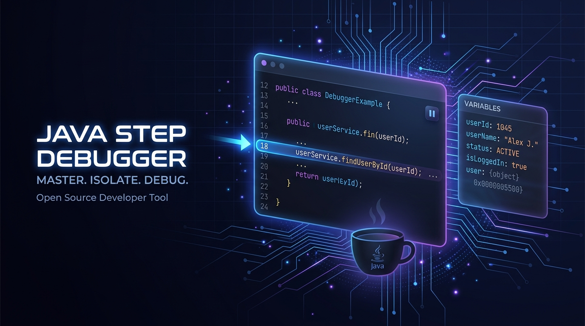

<div align="center">
  

  # ☕ JavTrace
  ### Interactive Java Execution Visualizer & Step Debugger

  [](https://forbegginers.vercel.app/)
  [](LICENSE)
  [](https://forbegginers.vercel.app/)
  [](https://forbegginers.vercel.app/)

  <p align="center">
    <strong>Stop guessing what happens inside loops. Step through Java code line-by-line, watch variables mutate in real time, and build intuition for DSA algorithms.</strong>
  </p>

  [**🌐 Launch Live Visualizer**](https://forbegginers.vercel.app/) • [**📖 Read the Docs**](https://forbegginers.vercel.app/about.html) • [**🐛 Report an Issue**](https://github.com/Bhavesh3961/Java-step-debugger/issues)

</div>

---

## ⚡ What is JavTrace?

**JavTrace** is an interactive, browser-based execution visualizer built for students, teachers, and engineers. 

Traditional debuggers in heavy IDEs require setting up projects, configuring JDK paths, and navigating complicated panels. JavTrace strips all the friction away: write or paste Java code directly into the execution canvas, press **Visualize Execution**, and scrub through runtime steps with immediate visual feedback.

Everything runs **100% client-side** in your browser with zero server latency, zero cold starts, and zero telemetry.

---

## ✨ Features

- 💻 **Integrated Compiler-Grade Canvas**: Type or paste Java directly into the execution container with pixel-aligned syntax highlighting, 4-space auto-indent on <kbd>Enter</kbd>, and smart brace handling.
- 🔍 **Live Frame & Variable Inspector**: Inspect local variables, arrays, loop indices, and method states with instant visual diff highlights on change.
- 🎚️ **Time-Travel Execution Scrubber**: Jump forward or backward through execution history using the slider or keyboard shortcuts (<kbd>→</kbd> / <kbd>←</kbd>).
- 🛡️ **Infinite-Loop Circuit Breaker**: Run loops with peace of mind—execution is capped at 10,000 steps so runaway loops never lock up your browser tab.
- ⌨️ **Standard Input (`stdin`) Support**: Dedicated input stream for interactive algorithmic challenges using `Scanner(System.in)`.
- 📦 **Curated DSA Algorithmic Presets**: One-click access to classic data structures and algorithms (Binary Search, Two Sum, Matrix Traversal, Reverse Number, Palindromes, Fibonacci recursion).
- 📱 **Mobile & Dark-Mode Native**: Crisp typography, high contrast, and responsive layout tuned for late-night coding sessions.

---

## 🕹️ Keyboard Shortcuts

| Shortcut | Action | Where |
| :--- | :--- | :--- |
| <kbd>→</kbd> (Right Arrow) | Step forward one line | Visualizer Mode |
| <kbd>←</kbd> (Left Arrow) | Step backward one line | Visualizer Mode |
| <kbd>Space</kbd> | Toggle auto-play / pause execution | Visualizer Mode |
| <kbd>Tab</kbd> | Insert 4 spaces indentation | Editor |
| <kbd>Enter</kbd> | Auto-indent with matching bracket depth | Editor |

---

## 🚀 Running Locally

JavTrace is completely static—no Node.js build process, Docker container, or database required.

### 1. Clone the repository
```bash
git clone https://github.com/Bhavesh3961/Java-step-debugger.git
cd Java-step-debugger
```

### 2. Start a local server
Using Python 3:
```bash
cd frontend
python3 -m http.server 3000
```

Or using Node:
```bash
npx serve frontend
```

### 3. Open in your browser
Navigate to `http://localhost:3000` to start exploring.

---

## 🌐 Deployment

The project is pre-configured for instant zero-configuration deployment on **Vercel**, **GitHub Pages**, or **Cloudflare Pages**.

- Root directory or `frontend/` directory contains `index.html`, `style.css`, `app.js`, and `simulator.js`.
- Simply connect your repository to Vercel and it deploys automatically on every push to `main`.

Live production link: **[https://forbegginers.vercel.app/](https://forbegginers.vercel.app/)**

---

## 🛠️ Supported Java Syntax in Browser Engine

- **Data Types**: `int`, `long`, `double`, `float`, `boolean`, `char`, `String`, arrays (`int[]`, `String[]`, 2D arrays).
- **Operators**: Arithmetic (`+`, `-`, `*`, `/` with integer division truncation, `%`), Bitwise, Logical, Ternary (`? :`).
- **Control Flow**: `if`, `else if`, `else`, `for`, `while`, `do-while`, `break`, `continue`, `switch/case`.
- **I/O**: `Scanner(System.in)` with `nextInt()`, `next()`, `nextLine()`, and `System.out.print` / `System.out.println`.
- **Standard Library Helpers**: `Math.max()`, `Math.min()`, `Math.abs()`, `Math.pow()`, `Math.sqrt()`, `String.length()`, `String.charAt()`.

---

## 👨‍💻 Author

Crafted by **[Bhavesh3961](https://github.com/Bhavesh3961)**.

Contributions, feature suggestions, and stars are always appreciated!

Distributed under the [MIT License](LICENSE).
